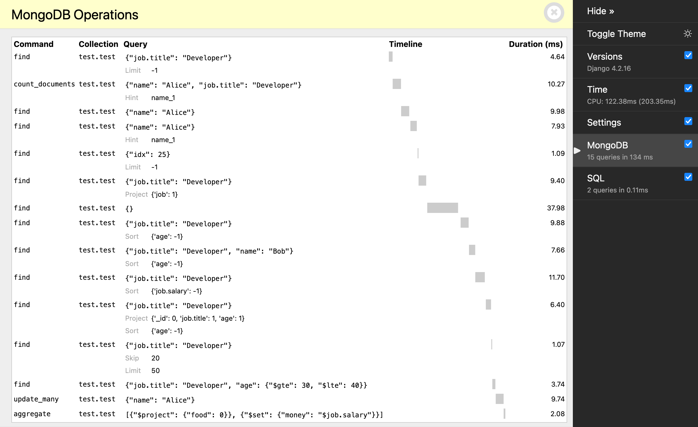

# Django Debug Toolbar MongoDB Panel

This is a [Django Debug Toolbar](https://django-debug-toolbar.readthedocs.io/en/latest/index.html)
[third-party panel](https://django-debug-toolbar.readthedocs.io/en/latest/panels.html#third-party-panels)
that tracks all the queries made to MongoDB.

*I don't encourage using MongoDB with Django, but if you are stuck with it, you might as well have a way to debug it.*




## Install

Ensure `django-debug-toolbar` is installed and working.
Then, run the following command:

```bash
uv install git+https://github.com/C4ptainCrunch/debug-toolbar-mongo.git#egg=debug_toolbar_mongo
```

## Setup

Add the following lines to your `settings.py`:

```python
INSTALLED_APPS = (
    # ...
    'debug_toolbar_mongo',
    # ...
)

DEBUG_TOOLBAR_PANELS = (
    # ...
    'debug_toolbar_mongo.MongoPanel',
    # ...
)
```

An extra panel titled "MongoDB" will appear in your debug toolbar.

# About

## Authors
This library was created by [Harry Marr](http://github.com/hmarr)
then upgraded by [CrazyPilot](https://github.com/CrazyPilot)
and finally refactored and packaged by [C4](https://github.com/C4ptainCrunch).

## License
This library is licensed under the MIT license.

## Contributing
This library is open-source, but as the current maintainer has little time available,
it is not seeking contributions.
However, if you do find a bug, please open an issue on GitHub.
